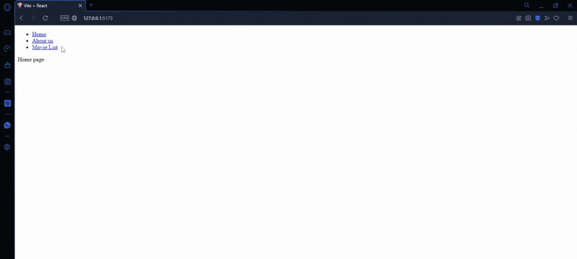
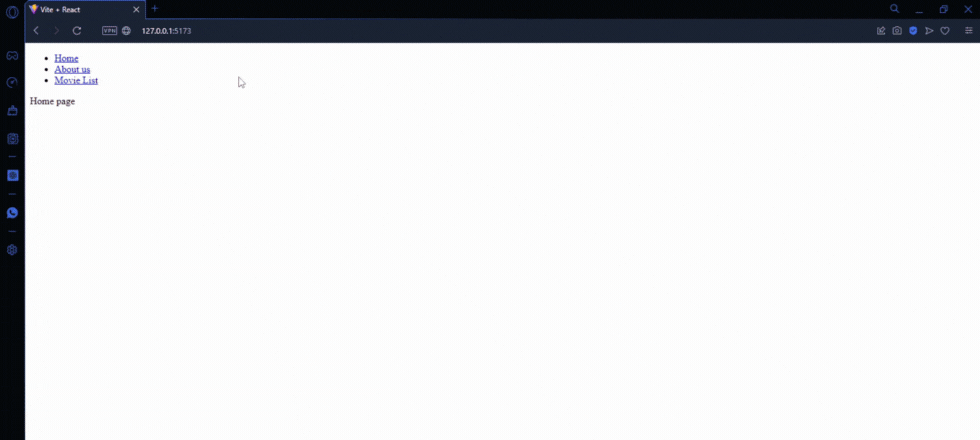
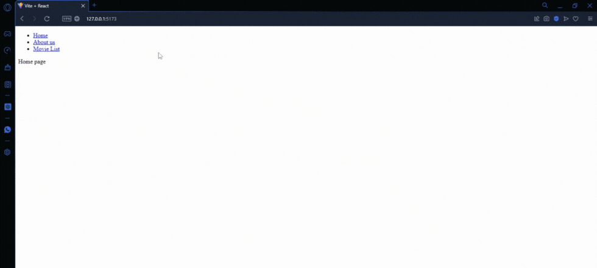

# 2D and 3D Movie Schedule Explorer - React Router

This React project utilizes advanced React Router functionalities, including useParams for accessing movie IDs and useSearchParams for handling search parameters. The application creates an intuitive explorer for 2D and 3D movie schedules, allowing users to search for movie showtimes and desired formats seamlessly. Navigation between various sections, such as the homepage, movie listings, and movie details, is dynamic and smooth, delivering an optimized user experience.

### Prerequisites

To use this application, you need to have knowledge of:

+ Node.js - Runtime environment for JavaScript.
+ ReactJS - JavaScript library for building interactive and reactive user interfaces.

### Installing and Running the Project

To download this project, run the following command down below.

```
git clone https://github.com/JuanPablo70/MoviesReactRouter.git
```

Once the project is downloaded, open it in your favorite code editor such as VSCode and execute the following commands in the terminal:

```
npm install

npm install react-router-dom

npm run dev
```

In a web browser, visit the link [http://127.0.0.1:5173/](http://127.0.0.1:5173/) to view the project.

### Project Functionality

**Dynamic Navigation:** The BrowserRouter component, along with the Routes and Route components, were utilized to navigate to the project's main pages, including the Home, the About Us section, and the Movie List section.



**Detailed Movie Exploration:** On the Movie List page, all available movies are displayed. Clicking on any of them redirects the user to a detailed movie page using the Route component and useParams to access the movie's ID. This functionality allows users to explore specific information about each movie.



**Filtering 2D and 3D Movies:** useSearchParams and the useNavigate hook were employed to implement a filtering system on the Movie List page. Users can filter movies between 2D and 3D formats, providing a personalized and efficient search experience.



### Build With

+ [Vite](https://vitejs.dev) - Next Generation Frontend Tooling
+ [React](https://es.react.dev) - The library for web and native user interfaces

### Version

1.0

### Author

[JuanPablo70](https://github.com/JuanPablo70)